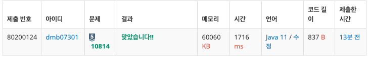

---

1. 소요시간 : 20분
2. 문제 사이트 : 백준
3. 문제 수준 : 실버 5
4. 문제 유형 : 정렬
5. 다른 사람의 풀이를 참고 했는가 ? : O
6. 문제 링크 : https://www.acmicpc.net/problem/10814

---

### 1. 사용한 자료구조 & 알고리즘


### 2. 소스코드
```java
import java.io.BufferedReader;
import java.io.IOException;
import java.io.InputStreamReader;
import java.util.Arrays;
import java.util.StringTokenizer;

public class Main {
public static void main(String[] args) throws IOException {
BufferedReader br = new BufferedReader(new InputStreamReader(System.in));
StringTokenizer st;

        int N = Integer.parseInt(br.readLine());
        String[][] arr = new String[N][2];

        for(int i = 0; i < N; i++){
            st = new StringTokenizer(br.readLine());

            arr[i][0] = st.nextToken();
            arr[i][1] = st.nextToken();
        }

        Arrays.sort(arr, (s1, s2) -> Integer.parseInt(s1[0]) - Integer.parseInt(s2[0]));

        for(int j = 0; j < N; j++) {
            System.out.println(arr[j][0] + " " + arr[j][1]);
        }
    }
}
```
### 3. 결과



